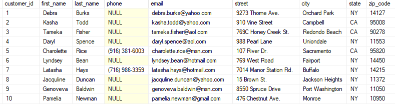

# Dabbling in Databases

## 1. Infrastructure preparation
### Create resources through Terraform
- 1x Virtual Network
- 3x Subnet (SQL, MySQL, Jumpbox)
- 3x Network Security Group
  - allow access from Jumpbox only to SQL Service Ports
  - allow access from Jumpbox only to MySQL Service Ports
  - allow access to Jumpbox only from Azure Bastion
- 2x Private DNS Zones
  - 1x for SQL
  - 1x for MySQL
  - Jumpbox should be able to use these Private DNS Zones and access SQL & MySQL by domain names which translate to PRIVATE IP Addresses
- 1x Azure Key Vault with HSM support
- 1x Disk Encryption Set
- 1x Dedicated Managed Identity for Encryption
- 1x Log Analytics Workspace with Daily Data Quota of 1 GB
- Minimal permissions for Encryption Managed Identity
- 1x Jumpbox VM:
  - Linux OS
  - Access only through Azure Bastion
  - Disks encrypted by Disk Encryption Set
  - HSM Key for Disk Encryption generated through Terraform
  - Admin username & key auto generated through Terraform and saved to Key Vault
- 1x SQL Server
  - Must be accessible through Private Network only
  - Admin username & password auto generated through Terraform and saved to Key Vault
  - Azure SQL Auditing to Log Analytics Workspace Enabled
- 1x SQL Database:
  - DTU Based Tier
  - TDE with
  - HSM Key for TDE generated through Terraform
- 1x Azure Database for MySQL Flexible servers
  - SameZone High Availability Enabled
  - Admin username & password auto generated through Terraform and saved to Key Vault
  - Data encryption enabled with custom HSM Key
  - Diagnostic Settings to Log Analytics Workspace Enabled - choose your own categories

## 2. SQL First Steps
0. Save all the below commands in your repository as part of solution
1. Connect to your SQL Database from Jumpbox VM
2. Create a new table with columns like in the picture below
3. Create a new user
4. Grant the user access to the table
5. Relogin to the new user
6. Add all the rows from picture below
7. Change street & city for customer_id=6 to something Polish

## 3. MySQL First steps
0. Save all the below commands in your repository as part of solution
1. Connect to your MySQL Database from Jumpbox VM
2. Create a new table with columns like in the picture below
3. Create a new user
4. Grant the user access to the table
5. Relogin to the new user
6. Add all the rows from picture below
7. Change Quotes_Status for all SR# ending with "68874" to Sent to Customer

## Summary:
- Prepare Architecture Diagram describing your solution
- The application code & Infrastructure As Code should be stored in your Azure DevOps Repository